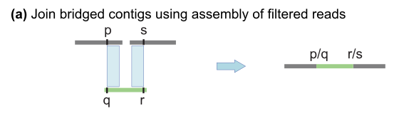
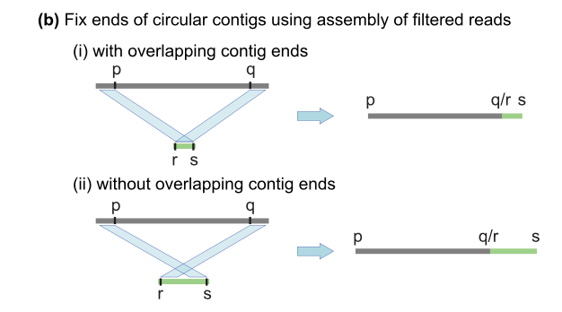

# Mitochondria Variant Calling Documentation

## Sample: HG00514.2
12,167 reads after subsetting 
<br />
<br />
<br />
<br />


## Genome Assembly:


1) Hifiasm + unfiltered reads w/o genome size parameter:
    - Quast report:
        - Genome fraction (%): 100
        - Duplication ratio: 84.7
        - Largest alignment: 17,534
        - Total aligned length: 1,404,365
        - GC content: 44.49
        - number of contigs: 59

2) Hifiasm + unfiltered reads w/ genome size (ran on unfiltered reads): 
- workflow failed: <br />
    ```./hifiasm -o "hifi_test" -t 4 --hg-size 16k ~{reads.fq}```

    ```awk '/^S/{print ">"$2;print $3}' hifi_test.bp.p_ctg.gfa > hifi_test.fa```

    ``` samtools faidx hifi_test.fa ``` 
    ``` wc -l hifi_test.fa.fai ```

3) Hifiasm + filtered reads w/ genome size
    - output: 59 contigs 
    - mean length: 18k
        - Alighment using minimap2: 
           -  ```./minimap2 -aYL --MD -t 8 ../chrM_ref.fa ../test_1.p_ctg.fa | samtools sort -o "chrM_test.bam" ``` 


4) Canu 2.2 with filtered reads:
    -  canu-correct issues:
        1) error due to less than 100 reads being corrected
        2) reads without overlapping

        ```
        --                             original      original
        --                            raw reads     raw reads
        --   category                w/overlaps  w/o/overlaps
        --   -------------------- ------------- -------------
        --   Number of Reads                282          7189
        --   Number of Bases            3066432        136616
        --   Coverage                   191.652         8.539
        --   Median                       10382             0
        --   Mean                         10873            19
        --   N50                          10577          8563
        --   Minimum                       8277             0
        --   Maximum                      16615          9539
        ```


    - Two approaches for correcting error caused by < 100 reads: 
    1) change source code 
    2) use parameter ```corOutCoverage```

    -  ```canu -correct corOutCoverage=100```
        - Quast stats:
            - 1 contig
            - largest alignment: 15,689
            - duplication ratio: 1.887
            - total length: 31,266
            - GC %: 44.42


5) MitoHiFi
    - container setup:
        ```
        sudo docker login
        sudo docker build .
        sudo docker images
        sudo docker tag <image name> <dockerID/imageID>
        sudo docker push <dockerID/imageID>
        sudo docker pull <dockerID/imageID>
        sudo docker run -it <imageID>
        ```
        convert fastq to fa:
        ```
        seqtk/seqtk seq -a classified_reads.for_assembly.fastq.gz > chrM_reads.fa
        ```
    - mount necessary files: 
        ```
        sudo docker run -it -v /home/ewan/MitoHiFi/reads_ref:/powerhouse_reads --entrypoint /bin/bash f84b6087a290
        ```
    - get GenBank file:
        ```
        findMitoReference.py --species "Homo sapiens" --email ewan@broadinstitute.org --outfolder /bin --min_length 16000
        ```

    - assemble using mitohifi.py

        ```
         mitohifi.py -r ../powerhouse_reads/chrM_reads.fa -f ../powerhouse_reads/chrM_ref.fa -g ../powerhouse_reads/LC657585.1.gb -t 10
        ```

        1. First we map your Pacbio HiFi reads to the close-related mitogenome
        2. Now we filter out any mapped reads that are larger than the reference mitogenome to avoid NUMTS
            2.1 First we convert the mapped reads from BAM to FASTA format: 
            ```samtools fasta reads.HiFiMapped.bam > gbk.HiFiMapped.bam.fasta```
            Total number of mapped reads: 7471
            2.2 Then we filter reads that are larger than 16569 bp. Number of filtered reads: 7286
        3. Now let's run hifiasm to assemble the mapped and filtered reads!
            ```hifiasm --primary -t 10 -f 0 -o gbk.HiFiMapped.bam.filtered.assembled gbk.HiFiMapped.bam.filtered.fasta```


## Contig Selection and Poishing
### Trim (by hand)
- trim soft-clipped region and align separately or throw away 
- filter out contigs that don't stretch the full length 16k
- Select contig:
    ```samtools view  chrM_test.bam | grep -F "h1tg000049" | less -S > select_contig.txt```
    - minimap2 align again: 
    ```./minimap2 -aYL -R'@RG\tID:blah\tSM:HG00514' --MD -t 8 ../chrM_ref.fa contig_trimmed.fa | samtools sort -o "second_alignment_chrM.bam"```

    - paftools to call variants from selected contig (paftools_mito.wdl):
        - paftools.js calls variants from assembly-to-assembly alignment
        - <paf_vcf.ipynb>: converts .paf output to vcf (can be done by paftools with -L10000)
             - convert to BED: <br />
                ```awk 'BEGIN {OFS="\t"} {print "chrM", $1-1, $1, $2"->"$3}' paf_fin_out.txt > mito_paf.bed```
            - <final.vcf>

    - align reads to assembly (instead of reference): <br />
        - align filtered reads to contig (check if contig deviates from reads) <br />
        ```./minimap2 -aYL -R'@RG\tID:ID\tSM:HG00514' --MD -t 8 contig_trimmed.fa chrM_raw_reads.fa | samtools sort -o "readstocontig_chrM.bam"```

    - Clair3: evaluate assembly - compare raw reads to selected contig
        - output: pileup.vcf; full_alignment.vcf; merged.vcf
        - visualize vcf output on IGV with readstocontig_chrM.bam (change reference to contig_trimmed.fa on IGV)
        - IGV shows:
            - variants identified (shown in vcf) are minor (not seen in most reads aka low allele frequency)
            - if selected contig is the representative one, there should be almost no variants?
            - this is why proceeded with polishing the contig (tools such as CD-HIT, Racon etc)

    - Call variants (paftools) from Racon polished contig


    - gatk Concordance:
        - evaluate TP, FP, FN, TN (for Racon contig) 
        - compare racon contig vcf with before polishing contig vcf
        - ```gatk Concordance -R <ref.fa> -eval ~/PATH/TO/paf_fin2.vcf --truth  ~/PATH/TO/Racon/racon_paf.vcf --summary summary.tsv -tpfn tpfn.vcf -tpfp tpfp.vcf```

    ### Polishing: 
    1) CONSENT:
        - description: self-correction for long reads. compute overlaps between long reads to define alignment pile (a set of overlapping reads used for correction) for each read.  multiple alignment strategy to compute consensus. then consensus is further polished with local de bruijn graph 
        - free(): invalid pointer. software not maintained.
    2) abPOA: (collapse contig)
        - description: performs multiple sequence alignment on a set of input sequences and generate a consensus by applying the heaviest bundling algo
        - segmentation fault
    3) CD-HIT: (collapse alignment into a single contig)
        - description: clustering and comparing protein or sequences
        - downloaded latest release and uploaded to VM
        - ```awk '/^>/ {print; next; } { seqlen = length($0); print seqlen}' file.fa```
        - with wrapped fasta:
            - ```awk '/^>/ {if (seqlen){print seqlen}; print ;seqlen=0;next; } { seqlen += length($0)}END{print seqlen}'```
        - 99% identity ng threshold)
        - output: 9 clusters with 1 with similar length

    4) Circlator: <br />
        - description: identify each circular sequence and output a linearized version. assemble all reads that map to contig ends and compare the resulting contigs with the input assembly.
        - failed experiments (using docker): 
        - ```sudo docker run --rm -it -v /home/ewan/data:/data sangerpathogens/circlator circlator all /data/test_1.p_ctg.fa /data/chrM_reads_raw.fasta /data/output_directory/all_contig```
            - raise Error('Error running SPAdes. Output directories are:\n  ' + '\n  '.join(kmer_to_dir.values()) + '\nThe reason why should be in the spades.log file in each directory.')
        - ```sudo docker run --rm -it -v /home/ewan/input:/input sangerpathogens/circlator circlator all --assembler canu /input/test_1.p_ctg.fa /input/chrM_raw_reads.fasta /output/616_output```

    5) Racon: 
        - <Racon.wdl> <mito_racon.wdl>
        - (polish contig based on raw reads)


## Evaluate Racon polished contig: 
```gatk Concordance -R ~/Desktop/alignment_filehistory/raw_reads_ref/chrM_ref.fa -eval ~/Documents/mito_vcf/paf_fin2.vcf --truth  ~/Desktop/alignment_filehistory/Racon/racon_paf.vcf --summary summary.tsv -tpfn tpfn.vcf -tpfp tpfp.vcf```


## Create Truth Data

- correct
<racon_to_truth.vcf>


## Improved Contig Selection and Trimming

1) 


BED file and visualize 

future work: 
- clustering variants (should see cluster around ethnicity)


create truth dataset:
- supporting reads


Hifiasm notes: 
- prefix`.r_utg.gfa: haplotype-resolved raw unitig graph. This graph keeps all haplotype information.
- `prefix`.p_utg.gfa: haplotype-resolved processed unitig graph without small bubbles. Small bubbles might
be caused by somatic mutations or noise in data, which are not the real haplotype information. Hifiasm automatically pops such small bubbles based on coverage
- `prefix`.p_ctg.gfa: assembly graph of primary contigs. This graph includes a complete assembly with long
stretches of phased blocks.
- `prefix`.a_ctg.gfa: assembly graph of alternate contigs. This graph consists of all contigs that are discarded
in primary contig graph.
- `prefix`.*hap*.p_ctg.gfa: phased contig graph. This graph keeps the phased contigs.


hifi parameters: 
- N 20 didn't change contig numbers but looks diff on IGV


./hifiasm -o "523_test" -t 4 -k 51 --pri-range 100 16700 --n-hap 1 --hg-size 16k chrM_filtered_rawreads.fastq


## Circlator (Algorithm)
- summary: run local assemblies of corrected reads that align to contig ends. use local assemblies to identify circular sequences 

1) Read filtering and local assembly
- input: assembly in fasta and reads in fasta/fastq
- only reads that map to either ends (first and last 50k bases of the contig) are retained. others trimmed. 
- filtered reads assembled using SPAdes 

2) Contig merging
- contigs (resulting SPAdes assembly) aligned to the original assembly using nucmer of MUMmer
- The longest match to each of the start and end of the SPAdes contigs is identified. <br />

- When a join is made, the filtered reads are remapped to the new merged assembly and the process of read filtering, assembly, and contig merging is repeated until no more contigs can be merged


3) Circularization
- once all possible merges are made, SPAdes assembly aligned to merged assembly
- circularize each contig: <br />
    using matches to contigs assembled from filtered reads



4) Contig refinement
- discard contigs shorter than 2000bp
- remove on-circular contigs:
    - assembly aligned to itself using nucmer 
    - contig A contained in contig B if: it wasn't identified as circular and alignment to contigB at least 95% identity and of length 95% of contigA. For each set of equivalent contigs, only the ongest contig retained. 
